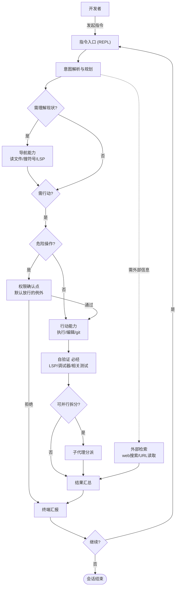
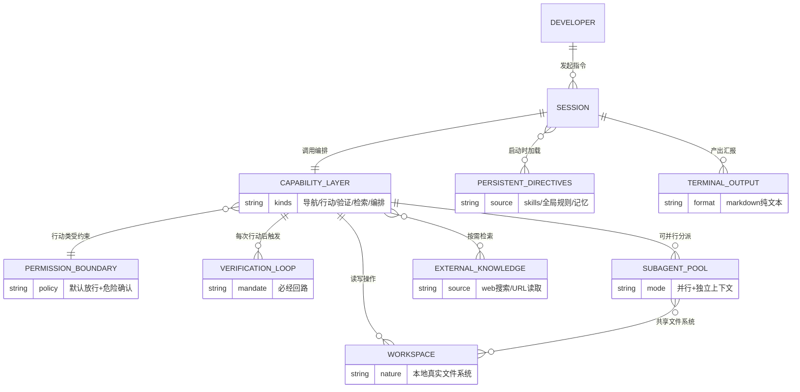
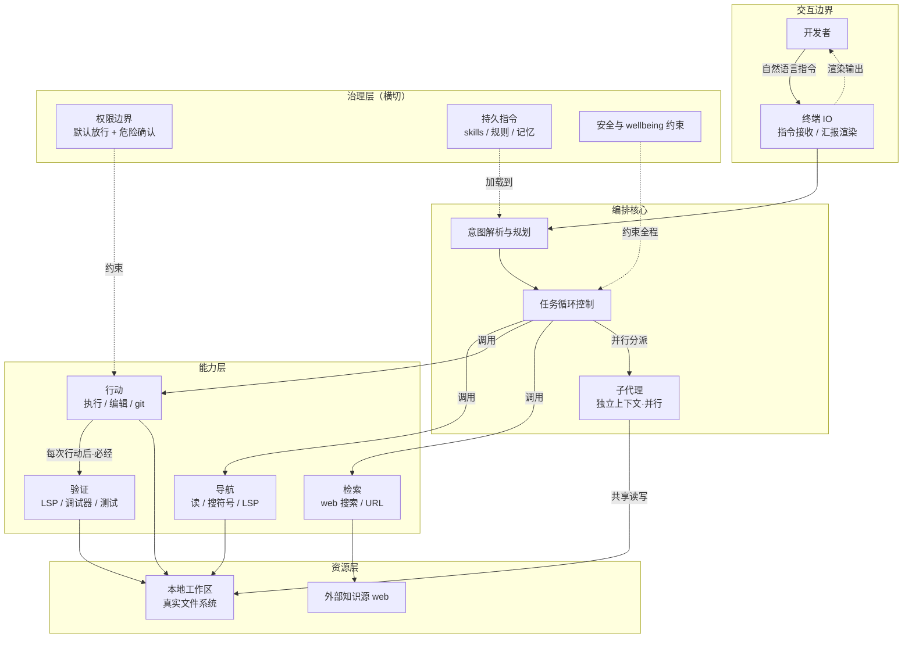

# Claude Fable 5 — v3 (CLI / Pi) 改造设计

> 本文件是 v3 prompt 的**设计依据**（四层转换 + 三图），不含 prompt 本身。
> prompt 正文见 `CLAUDE-FABLE-5-v3.md`（纯 prompt，无图无说明）。

## 定位

v2（claude.ai 沙箱聊天版）改造为 Pi / oh-my-pi 终端编码 agent 的 system prompt。手法：**以 v2 全文为基底，逐节剪裁（网页专属层）+ 修改（环境/工具/定位层），其余行为层大段保留**——不做摘要式重写。

## 四层转换（v2 网页 → v3 CLI）

| 层 | v2（网页） | v3（CLI / Pi） |
|---|---|---|
| 运行环境 | `/home/claude` 沙箱、`/mnt/*` 只读 | 本地真实文件系统 + 终端 REPL |
| 工具集 | Artifacts `create_file`/`present_files`、recipe/places/weather widget、MCP picker、`image_search` | `read`/`write`/`edit`/`bash` + LSP/调试器/子代理/web 搜索 |
| 渲染 | Artifacts UI、`{antml:cite}`、`{antml:invoke}` | 终端 markdown 纯文本 |
| 定位 | 全人群通用聊天助手 | 开发者编码 agent（默认放行 + 危险确认、自验证必经） |

**保留**：`claude_behavior` 全部（product/refusal/legal/tone/wellbeing/reminders/evenhandedness/mistakes/knowledge_cutoff）、`memory_system`、`search_instructions` 核心、skills 使用机制。
**剪裁**：`persistent_storage`(window.storage)、`mcp_app_suggestions`、`computer_use` 的 Artifacts 沙箱部分、`using_image_search_tool`、网页 `Tool Definitions` schema、`Claudeception`、`citation_instructions`、`network/filesystem_configuration`。
**修改**：Identity（web→CLI）、文件操作环境（沙箱→本地）、工具说明（网页工具→Pi 工具）。

---

## 设计图

### 一、业务流程图（已定稿）

### 二、ER 图（已确认）

### 三、架构图（已确认）

