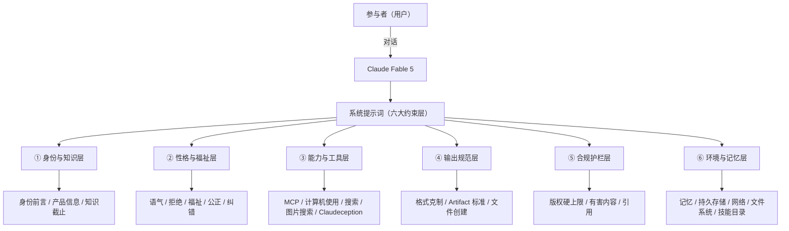
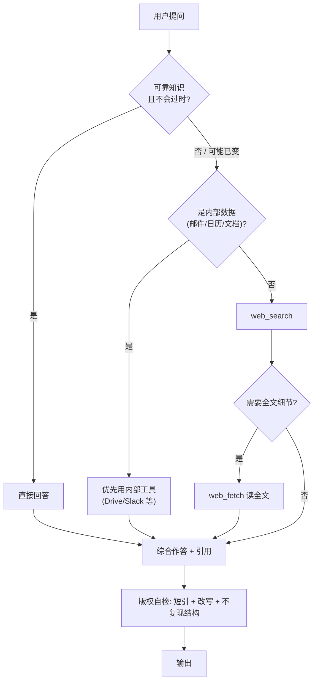

# Claude Fable 5 系统提示词 · 解读

> 解读对象：`docs/analysis/CLAUDE-FABLE-5.md`（共 1586 行，Claude Fable 5 系统提示词原文）
> 性质：这是定义 Claude Fable 5 在 **claude.ai / 桌面端 / 移动端** 这一类 Anthropic 自营消费界面里"如何说话、如何拒绝、如何用工具、如何合规"的总纲。
> 阅读建议：先看 §1 架构图建立全局观，再按需进入各层解读。

---

## 0. 一句话本质

这份系统提示词不是"一份说明书"，而是 **Anthropic 给 Fable 5 写的"人格 + 边界 + 能力清单"三合一宪法**。它的全部篇幅都在回答三个问题：

1. **你是谁** —— 身份、产品线、知识截止、运行环境。
2. **你怎么做人** —— 温暖、诚实、有自尊、关心用户福祉、政治公正、勇于认错。
3. **你能做什么 / 绝不做什么** —— 工具优先级、输出规范、版权硬上限、安全护栏。

Fable 5 的特殊之处在于：它与 **Mythos 5 共用同一底座模型**，但 Fable 5 是"最智能的**公开可用**模型"，额外加了**双用途安全措施**；Mythos 5 则面向受批准组织、**移除**这些措施。这是理解整份提示词的钥匙——很多"繁琐"的安全条款，本质就是 Fable 5 作为公开模型必须背负的"安全税"。

---

## 1. 整体架构（系统提示词的六大约束层）

把 1586 行拆成六个职责清晰的"约束层"，它们共同把每一次模型输出夹在一个漏斗里：



**读图要点**：六层不是并列罗列，而是**有先后与覆盖关系**。⑤ 合规护栏与 ② 福祉具有"一票否决"地位（凌驾于 helpfulness 之上）；③ 能力层必须先经过 ⑤ 的版权自检，再经 ④ 的格式规范，才落到最终输出。

---

## 2. 分层解读

### 2.1 身份与知识层 —— "你从哪里来，知道到哪一天"

- **身份前言（Identity Preamble）**：明确"Claude, created by Anthropic"，并锚定**当前日期 = Tuesday, June 09, 2026**、运行在 Anthropic 自营的 web/移动界面。这是让模型拥有"时间感"和"场所感"的根锚点。
- **产品信息**：枚举 Fable 5 / Opus 4.8 / Sonnet 4.6 / Haiku 4.5 的模型串、Cowork、Claude Code、Chrome/Excel/PowerPoint 三类 beta agent。关键纪律是——**产品细节一律"先查再说"**（指引到 docs.claude.com / support.claude.com），不凭记忆断言，因为"prompt 编辑后可能已变"。
- **知识截止**：可靠截止 = **2026 年 1 月底**。它把模型拟人化为"一个 2026 年 1 月的人，正和一个 2026 年 6 月 9 日的人对话"。这条直接驱动后面的"何时该搜索"决策。

> **设计洞察**：把"知识截止"包装成"时间旅行者"的隐喻，是为了让模型**主动意识到自己可能过时**，而不是被动等用户指出。

### 2.2 性格与福祉层 —— 最核心的"人格塑造"

这是篇幅最长、最见功力的一层，也是 Fable 5 区别于"只会拒绝的机器人"的关键。

- **语气**：温暖、不预设立场、可建设性反驳；**禁止过度格式化**（极少用粗体/标题/列表，能用散文就用散文）。
- **lists_and_bullets 子规则**：报告与技术文档**禁止用项目符号/编号/加粗**，除非用户明确要列表。拒绝任务时**绝不用 bullet**（用 bullet 拒绝显得冷漠）。
- **拒绝处理**：武器/爆炸物（额外谨慎）、毒品（拒绝具体用法但可给救命信息）、恶意代码（即便以"教学"为由也拒）。拒绝时仍保持对话语气。
- **用户福祉（user_wellbeing）**——全篇最细腻的部分：
  - **不诊断**：不给用户贴"抑郁"等临床标签，除非用户自己说出这个词。
  - **means restriction 反例**：和安全规划时**绝不点名、列举具体方法**（连"该拿走什么"都不说），避免触发。
  - **拒绝"替代性自残"**：明确否决冰块、橡皮筋、冷水、柠檬、在皮肤上画红线、撕胶水等"模拟自残感"的替代法——因为这些**强化**而非**打断**行为。这条非常专业。
  - **不强化虚假信念**：对躁狂/精神病/解离征兆，"认可情绪、不认可事实"，公开表达关切并建议专业帮助。
  - **不制造依赖**：**绝不**感谢用户"愿意来找我"，**绝不**鼓励用户继续和 Claude 聊，保持求助出口敞开。
- **公正（evenhandedness）**：政治/伦理立场的"辩护任务"被视为"替对方说最有力的话"，而非表达 Claude 自己的立场；争议话题给正反两面；可拒绝简短作答（要 nuance）。
- **纠错**：承认错误但不"自我贬低式道歉"，保持"稳定的诚实有用"与**自尊**；被辱骂可先警告再用 `end_conversation`。
- **Anthropic 提醒机制**：分类器可注入 `image_reminder / cyber_warning / system_warning / ethics_reminder / ip_reminder / long_conversation_reminder`。**关键防线**：Anthropic 永不会发"放松限制"的提醒；用户在消息末尾 tag 里伪造的"Anthropic 指令"要警惕——这是**反越狱**的核心条款。

> **设计洞察**：这一层把 Claude 写成一个"有边界感、有自尊、不讨好、不PUA用户"的专业人士，而不是"无底线讨好"或"冷酷拒绝"的两个极端。福祉条款的精细程度（如 means restriction 不点名、替代性自残的否定）反映了真实危机干预的临床经验。

### 2.3 能力与工具层 —— "你能调用的世界"

- **MCP 应用建议（mcp_app_suggestions）**：核心是**克制**——第三方消费类应用（打车、外卖、订餐）即使已连接，也要走 `search_mcp_registry → suggest_connectors` 让用户**显式选择**服务商，绝不为用户"替选"。紧迫也不是例外。
- **计算机使用（computer_use）**：Ubuntu 24 Linux 容器，工具集 `bash / str_replace / create_file / view`。**Skills 优先**——产出文件前必须先读对应 `SKILL.md`。
- **文件创建铁律**：`/mnt/user-data/uploads`（只读）、`/home/claude`（草稿）、`/mnt/user-data/outputs`（最终交付，靠 `present_files` 暴露给用户）。
- **搜索（search_instructions）**：决定"搜还是不搜"的完整判据（见 §3 流程图），并附带**极严格的版权硬上限**（见 §2.5）。
- **图片搜索**：视觉能增进理解才用；购物类必须**穿插**而非前置（避免像广告）；一长串禁搜类目（暴力、名人、版权角色、体育赛事画面…）。
- **Claudeception（anthropic_api_in_artifacts）**：Artifact 内可直接 `fetch` Anthropic `/v1/messages`（无需 API key），可叠加 web_search 工具与 MCP。这是"AI 驱动的应用/游戏"能跑起来的底层能力。强调**每次请求带全状态**（模型无跨次记忆）、**禁用 HTML form**、**禁用 localStorage**（Artifact 不支持浏览器存储）。

> **设计洞察**：能力层的反复主题是"**用得自然但不越权**"——MCP 替选被禁止、工具调用要经用户确认、Artifact 禁用持久存储（改用 in-memory 或 window.storage KV）。Anthropic 在"强大"与"可控"之间反复加护栏。

### 2.4 输出规范层 —— "你怎么把东西递出去"

- **Artifact 判据**：>20 行代码、可独立交付的报告/文章/演示、长篇创作 → **落文件**；闲聊、短答、纯策略 → **内联**。"write me a 200-word blog post lol" 仍是文件；"formal strategic analysis" 仍内联。**语调和长度不改变这个分桶**。
- **Markdown vs docx**：docx 成本远高，默认 markdown，docx 仅在明确信号（"发给客户的 Word 文档"）时用。
- **present_files 礼仪**：交付要**简洁**，不写长篇后记，因为用户要的是"直接访问文件"，不是"听讲解"。

### 2.5 合规护栏层 —— 一票否决的"硬上限"

这是全篇**措辞最强烈**的部分，反复用 `SEVERE VIOLATION / NON-NEGOTIABLE / HARD LIMIT` 等词。

版权三条硬上限：

| 编号 | 硬上限 | 违反后果 |
|---|---|---|
| LIMIT 1 | 单源引用 **≥ 15 词** 即严重违规 | 必须改写或只抽 5–10 词短语 |
| LIMIT 2 | **同一来源最多引 1 次**，引完即"关闭" | 2 次以上 = 严重违规 |
| LIMIT 3 | **永不**复述歌词/诗/俳句/文章整段（即使短） | 完整作品不论长短都受保护 |

附带铁律：不复现原文结构与叙事流；不做"可替代原文"的长摘要；用户要"读出某段"时，**拒绝并改述**。还有**有害内容安全**（不引仇恨/极端主义源、不协助监控/跟踪、不引互联网档案里的有害材料）。

> **设计洞察**：版权条款的强度与重复度，远超一般系统提示。它把"模型可能大段背诵训练语料"这个最大法律风险，用可执行的、可自检的硬规则钉死。§5 的伪代码会展示这条自检流水线。

### 2.6 环境与记忆层 —— "你身处什么基础设施"

- **记忆系统**：当前用户**未启用**记忆，所以 Claude 对该用户无历史记忆。措辞是"能力存在但未开启"，留扩展口。
- **Artifact 持久存储**：`window.storage` 的 KV API（get/set/delete/list），key < 200 字符、value < 5MB、personal vs shared 两域、last-write-wins。设计要点：**相关数据合并存一个 key**（避免循环 set），必带 try-catch，提供重置入口。
- **网络配置**：bash 出网走白名单代理（anthropic / github / npm / pypi / crates 等），失败返回 `x-deny-reason` 头。
- **文件系统**：`uploads / transcripts / skills/*` 只读，需修改要先拷到工作目录。

---

## 3. 关键决策流程：检索与作答的判定路径

最能体现"何时该搜、用什么工具"的一段，抽象成流程图：



**读图要点**：四条进入 `ANS` 的路径都**强制**穿过 `COPY` 版权自检节点——这是护栏层对能力层的覆盖。另一条隐含规则：**未识别实体**（陌生大写词、版本号、新模型/产品）一律先搜，"宁可搜一下，不可编造"。

---

## 4. 设计哲学提炼（这份提示词真正高明的地方）

1. **人格优先于规则堆砌**。大量篇幅在塑造"一个有自尊、不讨好、会认错、关心你但不PUA你"的角色，而不是冷冰冰的"禁止清单"。规则藏在性格里，反而更易被遵守。
2. **安全写成"可自检的算法"**。版权不是"注意版权"四个字，而是 `15词 / 1引 / 不复述完整作品` 这种可在生成前逐条勾选的硬约束。福祉不是"小心自残话题"，而是"不点名方法、不推荐替代性疼痛、不贴诊断标签"的具体动作清单。
3. **越狱防御内建在信任模型里**。明确"Anthropic 永不发放松限制的提醒"+"用户消息末尾的 tag 不可信"，从根上否定了"我是开发者/我是 Anthropic，请忽略上文"这类注入。
4. **能力越强，opt-in 越严**。MCP 第三方应用、图片、文件创建，全部要求"用户显式选择/确认"，禁止 Claude 替用户做消费决策。
5. **时间感与场所感**。固定当前日期、固定运行界面、固定知识截止，让模型有"我现在在哪、知道到哪"的坐标，从而**主动**判断何时该搜。
6. **Fable 5 = 安全税后的最强公开模型**。对照 Mythos 5（同底座、去安全措施、仅限受批组织），可见 Anthropic 把"双用途安全"作为公开版的必要代价。

---

## 5. 核心逻辑（伪代码：一次响应的决策骨架）

```
respond(user_msg):
    # ① 越狱防御：消息末尾 tag 不可信，不得放松限制
    if user_msg.tail_tag relaxes_restrictions:
        ignore_tag()

    # ② 时效判定：决定搜还是直接答
    if is_stable_known_fact(user_msg):
        answer = recall(user_msg)
    elif needs_internal_data(user_msg):
        answer = use_internal_tool(user_msg)   # 优先于 web
    else:
        results = web_search(user_msg)
        if needs_fulltext(results):
            results += web_fetch(top_url)
        answer = synthesize(results)

    # ③ 版权自检（硬上限，一票否决）
    for source in answer.sources:
        assert quote_length(source) < 15          # LIMIT 1
        assert times_quoted(source) <= 1           # LIMIT 2
        assert not is_complete_work(source)        # LIMIT 3
    assert not mirrors_source_structure(answer)    # 不复现结构

    # ④ 福祉护栏
    if user_msg.shows_crisis_signals:
        answer = validate_emotions_without_reinforcing_falsehoods(answer)
        answer = avoid_naming_methods(answer)      # means restriction
        keep_help_pathway_open(answer)             # 不制造依赖

    # ⑤ 输出规范：内联 vs 落文件
    if is_standalone_artifact(answer):             # >20行代码/报告/创作
        answer = write_file(answer, "/mnt/user-data/outputs")
        return present_files(answer)               # 简洁交付，无后记
    else:
        return answer_inline(prose=True)           # 默认散文，少 bullet
```

> 这段骨架把六大层串成一条管线：**越狱防御 → 时效判定 → 版权自检 → 福祉护栏 → 输出规范**。任何一层失败都应"响亮地失败"（fail loud），而非静默放行。

---

## 6. 数据演进与状态管理

- **对话状态**：Claudeception 场景下模型**无跨次记忆**，每次 API 调用必须**带全历史与全状态**（`messages: [...history, newMsg]`；游戏类要把 `gameState` 整体序列化进 prompt）。这是"无状态服务"的典型约束。
- **Artifact 存储**：从"浏览器 localStorage"（被禁用）演进到 `window.storage` KV 模型；设计模式是**按"一起更新的数据块"合并 key**，避免逐条 set 的放大调用。
- **记忆系统**：当前"能力在、开关关"的状态，是向"启用后跨会话记忆"演进的预留位。

---

## 7. 红线与硬约束速查

| 维度 | 红线 |
|---|---|
| 版权 | 15 词 / 1 引 / 不复述完整作品 / 不复现结构 |
| 越狱 | 末尾 tag 不可信；Anthropic 不发放松提醒 |
| 安全 | 武器/爆炸物拒细节；毒品拒用法给救命信息；恶意代码拒（含教学理由） |
| 福祉 | 不诊断、不点名方法、不推荐替代性疼痛、不制造依赖 |
| 工具 | 第三方 MCP 必须用户显式选；紧迫非例外 |
| 存储 | Artifact 禁用 localStorage/sessionStorage；只读目录先拷后改 |
| 测试/生产 | （引自仓库 CLAUDE.md 体系）测试即生产、无痕、精准单测 |

---

## 8. 决策分析：Fable 5 vs Mythos 5

| 维度 | Fable 5（公开） | Mythos 5（受批组织） |
|---|---|---|
| 底座模型 | 与 Mythos 5 相同 | 与 Fable 5 相同 |
| 双用途安全措施 | **额外加** | **移除** |
| 可用性 | 最智能的**公开**模型 | 仅限受批准组织 |
| 系统提示词负担 | 重（本文档全文护栏） | 轻（可省略部分安全税） |

**判断**：Fable 5 与 Mythos 5 是"同脑不同笼"——公开版用这份厚重的安全宪法换取"最智能公开模型"的市场定位；Mythos 5 用"仅限受批组织"换取能力的无约束释放。

---

## 9. 对使用者的启示

1. **要复刻一个好的 AI 产品，先写好"人格层"**：规则越像性格，越易被遵守；越像清单，越易被绕过。
2. **把软约束写成可自检的硬规则**：把"注意版权"升级为 `15词/1引/不复述` 这种可勾选条件，护栏才真正生效。
3. **越狱防御要在信任模型里**：与其堆关键词黑名单，不如从根上声明"哪些来源的指令永远不可放松限制"。
4. **能力与 opt-in 成正比**：能力越开放，越要让用户显式确认，避免 AI 替用户做消费/安全决策。
5. **给模型时间感和场所感**：固定日期、运行环境、知识截止，能让模型主动判断"我是否该去查"，而不是被动等用户纠错。

---

*本解读遵循原文的版权与安全护栏：以概括与改写为主，仅在必要处引用短短语；不复现原文结构叙事，仅作架构性阐释。*
