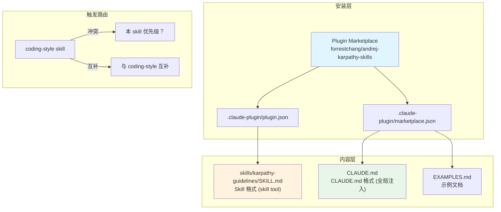

# Karpathy Guidelines Skill 技术分析

## 1. 核心确认 (Pre-Analysis Check)

✅ **上下文清晰**

| 项目 | 状态 |
|------|------|
| Skill 名称 | karpathy-guidelines |
| 来源 | forrestchang/andrej-karpathy-skills (GitHub) |
| 类型 | Claude Code Plugin + CLAUDE.md 双形态 |
| 核心功能 | LLM 编码行为准则，减少常见编码失误 |
| 依赖 | 无外部依赖，纯文本规范 |

---

## 2. 架构视图 (Architecture)



### 文件清单

| 文件 | 用途 | 格式 |
|------|------|------|
| `SKILL.md` | Skill tool 触发 | YAML frontmatter + Markdown |
| `CLAUDE.md` | 项目级全局注入 | Markdown |
| `EXAMPLES.md` | 示例集 | Markdown + 代码块 |
| `plugin.json` | 插件配置 | JSON |
| `marketplace.json` | 市场元数据 | JSON |

---

## 3. 核心逻辑 (Core Logic)

### 四大原则 (伪代码)

```
Principle_1_Think_Before_Coding():
    - state_assumptions()
    - present_alternatives()
    - push_back_when_warranted()
    - stop_and_ask_when_confused()

Principle_2_Simplicity_First():
    - no_speculative_features()
    - no_abstractions_for_single_use()
    - no_unrequested_flexibility()
    - rewrite_200_lines_to_50()

Principle_3_Surgical_Changes():
    - touch_only_requested_lines()
    - match_existing_style()
    - remove_only_your_orphans()
    - don't_delete_unrelated_dead_code()

Principle_4_Goal_Driven_Execution():
    - define_verifiable_success_criteria()
    - transform_imperative_to_declarative()
    - loop_until_verified()
```

### 触发条件

```
User Request (写代码/修改/重构)
    ↓
coding-style skill 激活
    ↓
检测 karpathy-guidelines 存在
    ↓
两大准则互补执行
```

---

## 4. 数据演进 (Data Evolution)

**本 skill 为静态规范，无数据变更场景。**

```
Input: 用户请求
    ↓
karpathy-guidelines 过滤
    ↓
Output: 更严谨的代码变更
```

---

## 5. 决策分析 (Decision Matrix)

### 【核心判断】✅ 值得集成

### 与现有 `coding-style` 对比

| 维度 | karpathy-guidelines | coding-style (内置) |
|------|---------------------|---------------------|
| **定位** | 行为准则 (流程) | 代码风格 (格式) |
| **核心** | 减少 LLM 认知偏差 | 极简主义 KISS |
| **触发** | 写代码/重构时 | 写代码/修改时 |
| **冲突** | 无直接冲突 | 互补而非竞争 |
| **示例** | 有 (EXAMPLES.md) | 无 |

### 价值评估

| 指标 | 评分 | 说明 |
|------|------|------|
| 实用性 | ⭐⭐⭐⭐ | 直接解决 LLM 常见问题 |
| 覆盖度 | ⭐⭐⭐⭐ | 四大原则覆盖主要失误 |
| 可操作性 | ⭐⭐⭐⭐⭐ | 明确的"测试"判断标准 |
| 示例质量 | ⭐⭐⭐⭐⭐ | EXAMPLES.md 详尽 |

### 潜在风险

| 风险 | 级别 | 缓解 |
|------|------|------|
| 与 coding-style 重复触发 | 低 | 两者互补，无冲突 |
| 过度谨慎影响效率 | 低 | 已标注"trivial 任务用 judgment" |

---

## 6. 实用性总结 (Practicality)

### ✅ 结论：值得安装

**理由：**
1. 直接对应 Karpathy 提出的 LLM 编码缺陷
2. 提供可验证的"测试标准"判断准则有效性
3. EXAMPLES.md 提供了丰富的正反例
4. 与项目现有的 `coding-style` 互补

**安装方式（二选一）：**
- **Plugin 方式**（推荐）：跨项目生效
- **CLAUDE.md 方式**：仅当前项目生效

**与现有规则的关系：**
- `coding-style`：极简代码风格
- `karpathy-guidelines`：行为准则
- 两者互补，建议同时保留
