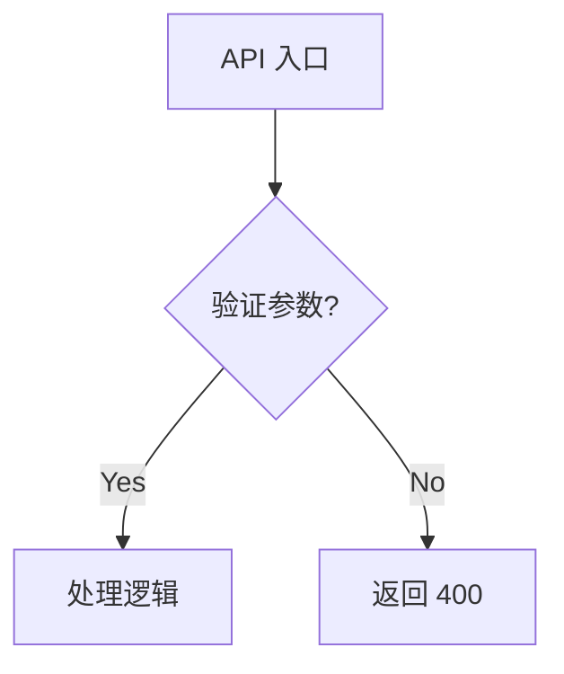
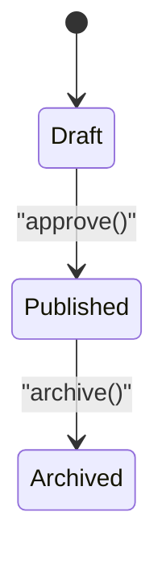

# 五层技术分析法 (含文档输出)

## 0. 阻断与确认机制 (Blocking & Confirmation)
**此步骤优先级最高。**
- **拒绝假定 (Anti-Assumption)**: 遇到变量定义不明、API 来源缺失、业务逻辑模糊时，**严禁**自行假定。**立即停止**并列出 "❓ 待确认问题清单"。
- **时间排毒 (Time Detox)**: 除非用户明确要求 "估时"，否则**严禁**输出时间估算。

## 1. 架构可视化 (Visual Structure)
- **工具**: 必须使用 `mermaid`。
- **内容**: 绘制类图 (Class Diagram) 或 实体关系图 (ER Diagram)。

### 1.1 Mermaid 语法铁律 (Syntax Guardrails)
**为防止渲染失败，必须严格遵守以下规则：**
1.  **ID 与 文本分离**: 节点 ID 必须是纯英文/数字（无空格）。显示文本必须用**双引号**包裹。
    * ✅ 正确: `A["用户 (User)"] --> B{"是否登录?"}`
    * ❌ 错误: `A[用户 (User)] --> B{是否登录?}`
2.  **特殊字符转义**: 文本中若包含 `[]` `()` `{}` 等符号，必须转义或移除。
3.  **简单优于复杂**: 不要使用复杂的 `style` 或 `classDef`，除非绝对必要。优先保证拓扑结构正确。

## 2. 逻辑抽象 (Logic Abstraction)
- **代码禁令**: 严禁引用大段真实代码。
- **形式**: 仅使用 **函数签名** 和 **伪代码** (如 `func(input) -> output`)。

## 3. 数据演进 (Data Evolution)
- **核心**: 描述数据在存储层或传输层的变化。
- **场景 A (结构变更)**: 简化的映射格式：`Table.OldField -> Table.NewField`。
- **场景 B (状态流转)**: 必须使用 `stateDiagram-v2`。
    * **注意**: 同样遵循 1.1 中的“双引号”规则。
- **严禁**: 粘贴大段 SQL `ALTER TABLE` 语句。

## 4. 复杂度与特例 (Complexity)
- 识别深层嵌套 (>3层) 和关键 `if/else` 分支。

## 5. 实用性总结 (Practicality)
- 结论：可行性、风险点、代码行数预估。

---

## 输出模板 (Output Template)

分析结果**必须写入** `[doc|docs]/analysis/{topic}.md` (UTF-8)，使用 Write 工具。

### 1. 核心确认 (Pre-Analysis Check)
*(✅ 上下文清晰 / ❓ 待确认问题)*

### 2. 架构视图 (Architecture)


### 3. 核心逻辑 (Core Logic)

*(伪代码关键路径)*

* `[Service A] -> [Service B]: Action`

### 4. 数据演进 (Data Evolution)

* **Schema 变更**:
* `User.data` -> `UserProfile` Table


* **状态流转**:



### 5. 决策分析 (Decision Matrix)

* **【核心判断】** ✅ 值得做 / ❌ 不值得做
* **【方案对比】**
| 维度 | 方案 A | 方案 B |
| --- | --- | --- |
| 复杂度 | 低 | 高 |

```
