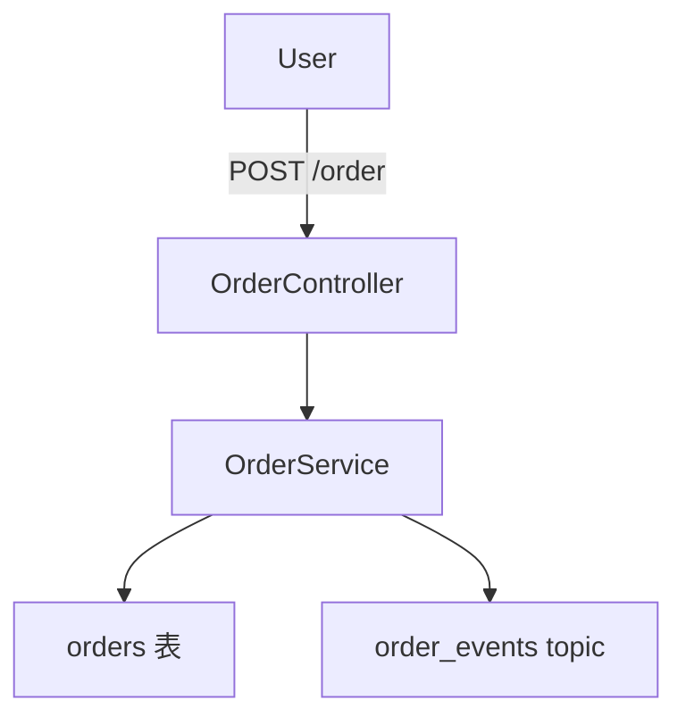
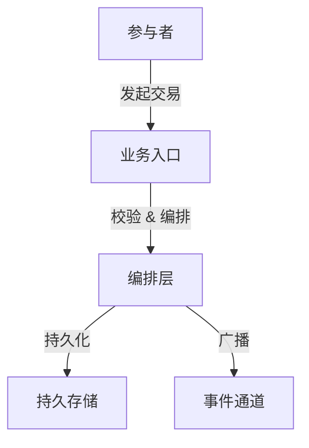
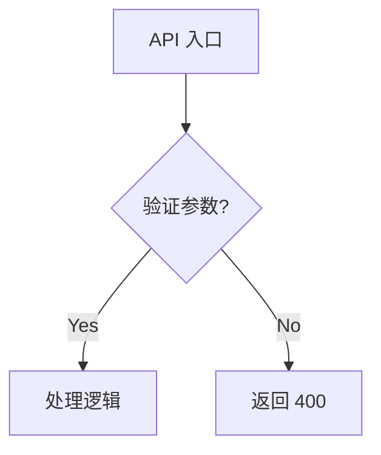
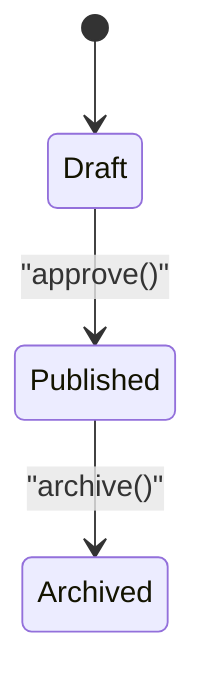

# 五层技术分析法 (含文档输出)

## 0. 阻断与确认机制 (Blocking & Confirmation)
**此步骤优先级最高。**
- **拒绝假定 (Anti-Assumption)**: 遇到变量定义不明、API 来源缺失、业务逻辑模糊时，**严禁**自行假定。**立即停止**并列出 "❓ 待确认问题清单"。
- **时间排毒 (Time Detox)**: 除非用户明确要求 "估时"，否则**严禁**输出时间估算。

## 三步确认工作流 (Three-Diagram Confirmation Workflow)

**强制性交互流程。在写入完整分析文档之前，必须按顺序逐一确认以下三张概念级图。禁止跳过或一次性输出全部。**

### 第一步：业务流程图 (Flowchart)
描述**参与者如何通过一系列动作完成目标**。
1. 基于1.0的概念抽象规则，输出 `graph TD/LR` 流程图
2. 与用户讨论：流程是否正确、是否有遗漏的分支
3. 根据反馈修改，直到用户确认 ✅

### 第二步：实体关系图 (ER Diagram)
描述**核心概念之间的关联**（非表结构、非字段列表）。
1. 基于1.0的概念抽象规则，输出 `erDiagram` 实体关系图
2. 与用户讨论：概念是否完整、关系是否正确
3. 根据反馈修改，直到用户确认 ✅

### 第三步：架构图 (Architecture Diagram)
描述**职责边界与通信方向**。
1. 基于1.0的概念抽象规则，输出 `graph TD` 架构图
2. 与用户讨论：边界划分是否合理、通信方向是否正确
3. 根据反馈修改，直到用户确认 ✅

> **三图全部确认后，方可进入后续分析层并写入完整文档。** 每一步都是交互式的——输出、讨论、修改、确认，而非单向输出。

---

## 1. 架构可视化 (Visual Structure)

### 1.0 概念抽象 (Concept Abstraction)
**画图前的强制性步骤。核心原则：架构师的伟大之处在于把具体的东西抽象出来，让图有更大的适应性和扩展性。**

#### 步骤一：选图类型
根据**分析意图**选择图类型，而非"有什么数据就画什么图"：

| 分析意图 | 图类型 | 概念级定位（回答什么问题） |
|---------|--------|--------------------------|
| 梳理业务流程 / 用户旅程 | Flowchart (`graph TD/LR`) | **参与者**如何通过一系列**动作**完成**目标** |
| 梳理核心概念间的关系 | ER 图 (`erDiagram`) | **核心概念**之间的**关联**（非表结构，非字段列表） |
| 梳理系统拓扑 / 组件边界 | 架构图 (`graph TD`) | **职责边界**与**通信方向** |
| 梳理 API 调用链 / 微服务协作 | 时序图 (`sequenceDiagram`) | **角色间对话**的顺序与协议 |
| 梳理状态生命周期 | 状态图 (`stateDiagram-v2`) | **主体**从创建到消亡经历的**阶段** |
| 梳理类/接口职责 | 类图 (`classDiagram`) | **抽象角色**的**行为契约**，非具体实现 |

#### 步骤二：实体抽象
**将代码级名称替换为概念级角色。铁律：图中不得出现任何代码标识符（表名、类名、API路径、字段名、Topic名）。**

| 代码级（❌ 禁止入图） | 概念级（✅ 必须使用） |
|---|---|
| `User`, `Admin`, `Customer` | **参与者 (Actor)**，或按角色细分：**发起方 / 审批方 / 受众** |
| `Order`, `Product`, `Inventory` | **交易主体 (Transaction)** / **资源 (Resource)** |
| `OrderService`, `PaymentService` | **编排层 (Orchestrator)** / **能力提供方 (Capability Provider)** |
| `POST /api/login`, `AuthController` | **认证入口** / **凭证校验点** |
| `Kafka topic: order_events` | **事件通道 (Event Channel)** |
| `Redis`, `MySQL`, `S3` | **热存储 / 持久存储 / 对象存储**（按数据温度/用途分层，非按产品名） |
| `users` 表, `orders` 表 | **主体档案 (Profile)** / **业务记录 (Record)** |

#### 步骤三：概念级画法对照
以"用户下单"为例，展示实现级（翻译代码）与概念级（架构分析）的区别：

**❌ 实现级 — 翻译代码，换个框架图就废了：**

```mermaid
graph TD
    User["User"] -->|"POST /order"| OrderController["OrderController"]
    OrderController --> OrderService["OrderService"]
    OrderService --> OrderDB["orders 表"]
    OrderService --> Kafka["order_events topic"]
```

**✅ 概念级 — 描述模式，换了语言/框架图不变：**

```mermaid
graph TD
    Actor["参与者"] -->|"发起交易"| Entry["业务入口"]
    Entry -->|"校验 & 编排"| Orchestrator["编排层"]
    Orchestrator -->|"持久化"| Store["持久存储"]
    Orchestrator -->|"广播"| EventBus["事件通道"]
```

> 概念级图回答 **"这是什么模式"**。实现级图回答 **"这代码长什么样"**。

### 1.1 Mermaid 语法铁律 (Syntax Guardrails)
**为防止渲染失败，必须严格遵守以下规则：**
1.  **ID 与 文本分离**: 节点 ID 必须是纯英文/数字（无空格）。显示文本必须用**双引号**包裹。
    * ✅ 正确: `A["用户 (User)"] --> B{"是否登录?"}`
    * ❌ 错误: `A[用户 (User)] --> B{是否登录?}`
2.  **特殊字符转义**: 文本中若包含 `[]` `()` `{}` 等符号，必须转义或移除。
3.  **简单优于复杂**: 不要使用复杂的 `style` 或 `classDef`，除非绝对必要。优先保证拓扑结构正确。

## 2. 逻辑抽象 (Logic Abstraction)
- **代码禁令**: 严禁引用大段真实代码。
- **形式**: 仅使用 **函数签名** 和 **伪代码** (如 `func(input) -> output`)。

## 3. 数据演进 (Data Evolution)
- **核心**: 描述数据在存储层或传输层的变化。
- **场景 A (结构变更)**: 简化的映射格式：`Table.OldField -> Table.NewField`。
- **场景 B (状态流转)**: 必须使用 `stateDiagram-v2`。
    * **注意**: 同样遵循 1.1 中的“双引号”规则。
- **严禁**: 粘贴大段 SQL `ALTER TABLE` 语句。

## 4. 复杂度与特例 (Complexity)
- 识别深层嵌套 (>3层) 和关键 `if/else` 分支。

## 5. 实用性总结 (Practicality)
- 结论：可行性、风险点、代码行数预估。

---

## 输出模板 (Output Template)

分析结果**必须写入** `[doc|docs]/analysis/{topic}.md` (UTF-8)，使用 Write 工具。

### 1. 核心确认 (Pre-Analysis Check)
*(✅ 上下文清晰 / ❓ 待确认问题)*

### 2. 架构视图 (Architecture)

```mermaid
graph TD
    A["API 入口"] --> B{"验证参数?"}
    B -- "Yes" --> C["处理逻辑"]
    B -- "No" --> D["返回 400"]

```

### 3. 核心逻辑 (Core Logic)

*(伪代码关键路径)*

* `[Service A] -> [Service B]: Action`

### 4. 数据演进 (Data Evolution)

* **Schema 变更**:
* `User.data` -> `UserProfile` Table


* **状态流转**:

```mermaid
stateDiagram-v2
  [*] --> Draft
  Draft --> Published : "approve()"
  Published --> Archived : "archive()"

```


### 5. 决策分析 (Decision Matrix)

* **【核心判断】** ✅ 值得做 / ❌ 不值得做
* **【方案对比】**
| 维度 | 方案 A | 方案 B |
| --- | --- | --- |
| 复杂度 | 低 | 高 |

```
